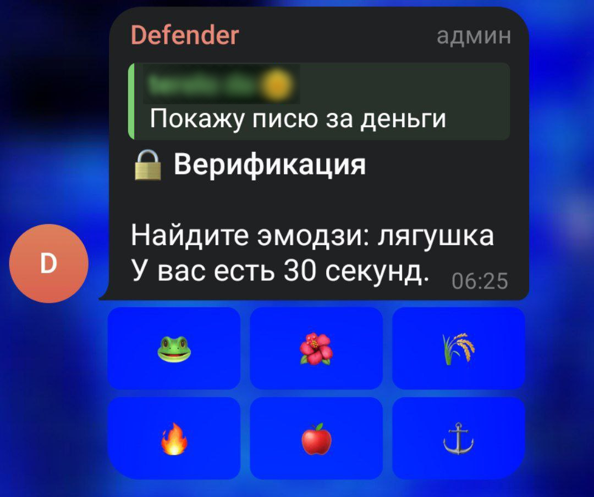
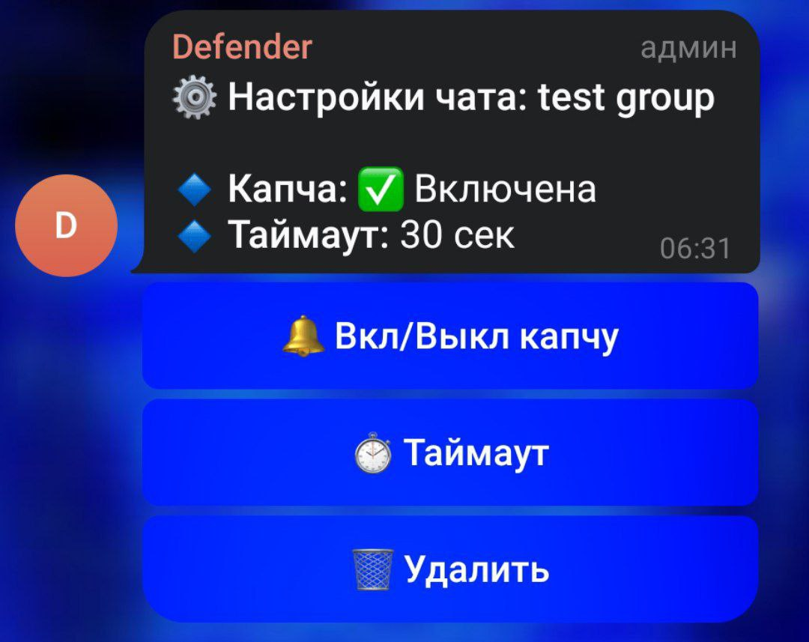

# Proof Of Human


---

👨‍🦽 Автор: [asynco](https://t.me/asynco) - 🔗 Ресурсы: [asynco_bio](https://t.me/asynco_bio) - 🧢 Бот: [@proof_of_human_bot](https://t.me/proof_of_human_bot)

---

Это Telegram бот для защиты от спама с каптчей и глобальной верификацией пользователей.

Можешь создать своего бота или использовать уже готового:

1. Запусти TG бота: [@proof_of_human_bot](https://t.me/proof_of_human_bot)
2. Добавь его в свой чат
3. Выдай админку (удаление сообщений)

---

## Особенности

- **Word-Based Captcha** — боту нужно понять семантику чтобы пройти
- **Глобальная верификация** — прошел один раз, получил доступ везде
- **Настройки в чате** — `/settings` для настройки чата
- **Настраиваемый таймаут** — 10/30/60/120 секунд на каптчу

---

## Скриншоты

### Каптча (Word-based)


### Настройки чата


---

## Конфигурация .env

### 1. Создание Telegram бота

Откройте [@BotFather](https://t.me/BotFather) в Telegram:
1. Напишите `/newbot`
2. Следуйте инструкциям
3. Скопируйте полученный токен (пример: `1234567890:ABC...`)

### 2. Получение OWNER_ID

Напишите [@userinfobot](https://t.me/userinfobot) или [@GetMyIdBot](https://t.me/GetMyIdBot):
- Скопируйте ваш числовой ID (пример: `123456789`)

### 3. Создание .env файла

Скопируйте пример и отредактируйте:

```bash
cp .env.example .env
nano .env  # или ваш редактор
```

Содержимое `.env`:
```env
BOT_TOKEN=1234567890:ABCDEF1234567890abcdef1234567890AB
BOT_USERNAME=proof_of_human_bot
OWNER_ID=123456789
```

### 4. Важно: Privacy Mode 

Бот должен видеть все сообщения в чатах для работы каптчи. В [@BotFather](https://t.me/BotFather) отправьте:
1. Отправьте /setprivacy
2. Выберите вашего бота
3. Отключите Privacy Mode

---

## Установка Docker

```bash
# Клонирование репозитория
git clone https://github.com/yourusername/proof-of-human.git
cd proof-of-human

# Настройка конфигурации
cp .env.example .env
nano .env  # вставьте BOT_TOKEN, BOT_USERNAME, OWNER_ID

# Запуск
docker-compose up -d --build

# Проверка логов
docker-compose logs -f bot
```

---

## 💬 Команды бота

| Команда | Описание | Кто может |
|---------|----------|-----------|
| `/settings` | Настройки чата (капча, таймаут) | Только админы |
| `/start` | Информация о боте | Все пользователи |

---

## Логика каптчи

1. **Новый пользователь пишет сообщение** → Бот проверяет верификацию
2. **Не верифицирован?** → Отправляется word-based каптча
3. **Каптча показывает описание** ("яблоко") вместо эмодзи (🍎)
4. **6 кнопок с эмодзи** → Пользователь кликает правильную
5. **Верно?** → Статус `verified=1` глобально
6. **Таймаут?** → Cleanup задача удаляет каптчу через 10 сек
7. **Повторная попытка** → Новая каптча (старая удалена из БД)

**Защита от ботов:**
- Простой парсинг больше не работает (нужно семантическое понимание)
- Рандомные формулировки ("Выберите:", "Найдите:", "Укажите:")
- Словарь из 27+ эмодзи с уникальными описаниями

---

## Структура проекта

```
proof-of-human/
├── handlers/           # Обработчики команд и callback'ов
│   ├── captcha.py      # Логика каптчи
│   ├── settings.py     # Настройки чата
│   ├── chat_member.py  # События чата (вход/выход)
│   ├── start.py        # Команда /start
│   └── owner.py        # Owner команды
├── middleware/         # Middleware цепочка
│   ├── verification.py # Проверка верификации
│   └── error_handler.py# Глобальная обработка ошибок
├── database/           # SQLite модели
│   ├── user_table.py   # Таблица пользователей
│   ├── captcha_table.py# Таблица каптч
│   └── chat_table.py   # Таблица чатов
├── utils/              # Вспомогательные функции
│   ├── captcha.py      # Генерация каптчи
│   ├── emoji_descriptions.py # Словарь описаний
│   └── helpers.py      # Хелперы
├── tasks/              # Фоновые задачи
│   └── cleanup.py      # Очистка истекших каптч
├── logs/               # Логи (автосоздание)
├── database/base/      # SQLite база (автосоздание)
├── config.py           # Конфигурация бота
├── main.py             # Точка входа
├── requirements.txt    # Зависимости Python
├── Dockerfile          # Docker образ
├── docker-compose.yml  # Docker Compose конфиг
└── .env.example        # Пример конфигурации
```

---

## Troubleshooting

### Бот не отвечает в группах
**Причина**: Бот не admin или Privacy Mode включен  
**Решение**:
1. Сделайте бота администратором чата
2. Отключите Privacy Mode в @BotFather

### Ошибка "BOT_TOKEN is missing"
**Причина**: Файл `.env` не создан или пустой  
**Решение**: `cp .env.example .env` и заполните данные

### Бот работает, но не показывает каптчу
**Причина**: Капча выключена в настройках чата  
**Решение**: `/settings` → "🔔 Вкл/Выкл капчу"

### Docker ошибка "Cannot connect to daemon"
**Решение**: `sudo systemctl restart docker`

## Обновление на новые версии

### Docker
```bash
git pull origin main
docker-compose down
docker-compose up -d --build
```

### Без Docker
```bash
git pull origin main
source .venv/bin/activate
pip install -r requirements.txt
pkill -f "python main.py"
python main.py &
```

---

## Лицензия

[MIT License](LICENSE)
